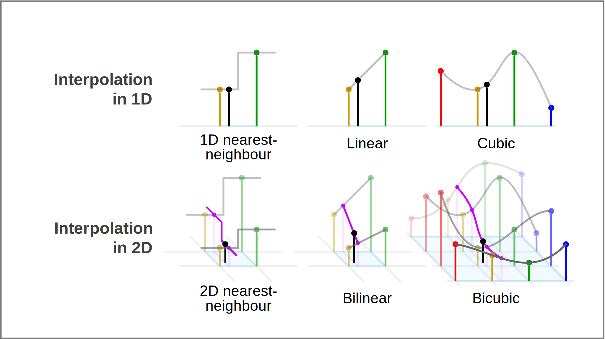

* interpolation-comparison-2d-3d.svg: [Link](https://commons.wikimedia.org/wiki/File:Comparison_of_1D_and_2D_interpolation.svg)
* interpolation-nearest.svg: [Link](https://commons.wikimedia.org/wiki/File:Interpolation-nearest.svg)
* interpolation-bilinear.svg: [Link](https://commons.wikimedia.org/wiki/File:Interpolation-bilinear.svg)
* interpolation-bicubic.svg: [Link](https://en.wikipedia.org/wiki/File:Interpolation-bicubic.svg)
* interpolation-methods-2d.svg: See  [interpolation-collage.pptx](../../../2024-FS/slides/08/interpolation-collage.pptx)  (slides/08)
* interpolation-comparison-2d-3d-plus.svg: See [interpolation-collage.pptx](../../../2024-FS/slides/08/interpolation-collage.pptx)  (slides/08)

